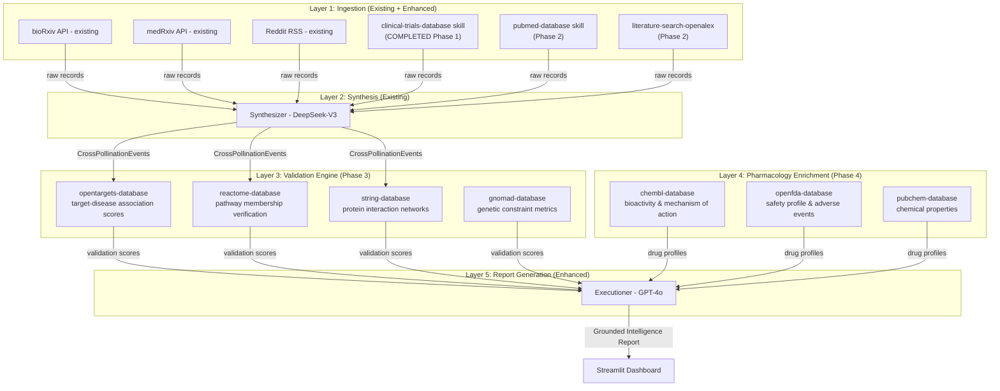

# PathwayPulse Integration Plan: Google Science Skills

This document outlines the maximal integration of Google Science Skills into the PathwayPulse codebase. 
**Phase 1 is complete.** We are now proceeding to Phases 2-5, utilizing Python-level wrappers (Option B).

## Architectural Strategy

The key insight: skills don't *replace* the Python pipeline — they create **new layers** that the agent can invoke to **validate, enrich, and ground** the LLM's outputs. All skills will be integrated as native Python functions calling the underlying APIs.

## Phase 2: New Data Sources (Literature & Citations)

### 2A. `pubmed-database` → Add Peer-Reviewed Literature
**Integration approach:**
A new ingestion function `fetch_pubmed_literature(pathway, days_back)` in `swarm_ingestion.py` that:
1. Searches PubMed for the pathway term.
2. Fetches abstracts for the top results.
3. Returns records in the `{source, title, abstract, url}` format.
4. Uses NCBI E-utilities. Look at the `pubmed-database` skill script for reference.

### 2B. `literature-search-openalex` → Citation Graph Intelligence
**Integration approach:**
- Use OpenAlex to fetch citation counts or check if a preprint has been published in a peer-reviewed journal.
- Implement in `swarm_ingestion.py` to annotate preprint records with `citation_count`.

## Phase 3: Biological Validation Engine (The Core Upgrade)

Currently, the Synthesizer and Executioner rely 100% on LLM reasoning. We will add **ground truth** databases.

### 3A. `opentargets-database` → Target-Disease Association Scoring
**Integration approach:**
Add a `validate_events()` step in `ai_orchestrator.py` between the Synthesizer and Executioner:
- Query OpenTargets for each `(pathway_gene, novel_indication)` pair via their GraphQL API.
- If association score > 0, the signal isn't completely novel (add this context).
- Append `opentargets_association_score` to each `CrossPollinationEvent`.

### 3B. `reactome-database` & `string-database`
**Integration approach:**
- Reactome: Pathway enrichment analysis on the set of target genes mentioned across events.
- STRING: Query interaction partners to see if novel targets interact with known pathway members.
- Provide this validation context to the Executioner prompt.

## Phase 4: Pharmacology Enrichment Layer

### 4A. `chembl-database`, `openfda-database`, `pubchem-database`
**Integration approach:**
- When a drug name is mentioned (e.g., "tocilizumab"), fetch its MoA, bioactivity data, and safety alerts.
- Inject this data into the Executioner prompt so the "Risk Factors" and "Watch List" sections include factual pharmacology.

## Phase 5: Advanced Integrations (Stretch Goals)

- `ensembl-database`: Resolve gene symbols.
- `uniprot-database`: Protein function annotations.
- `quickgo-database`: Gene Ontology mapping.

## Developer Note
Do NOT run the skill CLI tools as subprocesses in the final app. Instead, read the `.py` scripts inside `~/.gemini/config/plugins/science/skills/<skill_name>/scripts/` to understand the API endpoints, parameters, and authentication (if any), and then write equivalent native Python `requests`/`httpx` functions in the PathwayPulse codebase.
